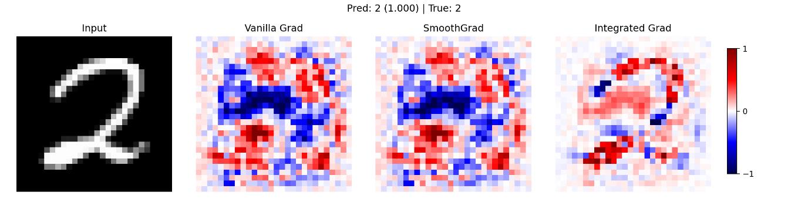
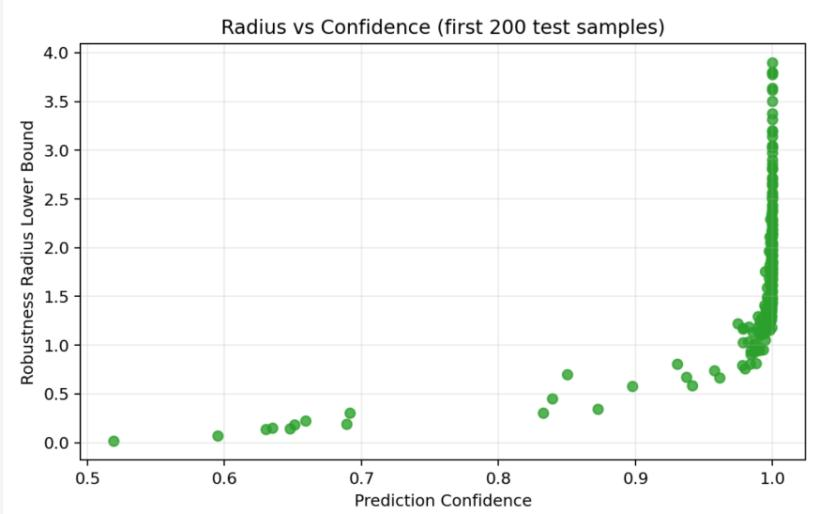
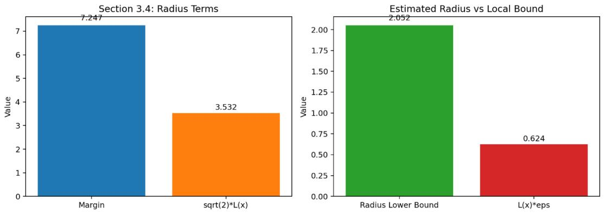

# Robustness Analysis of Neural Networks (MNIST, MLP)

## 📌 Overview

This project explores the robustness of neural networks under different types of input perturbations.

We implement a Simple Multi-Layer Perceptron (MLP) on the MNIST dataset and analyze robustness from multiple perspectives:

* Sensitivity analysis (gradients & Jacobians)
* Analytical robustness (Lipschitz bounds)
* Adversarial attacks (FGSM, PGD, DeepFool, C&W)
* Sampling-based robustness (random noise, Monte Carlo)

---

## 🧠 Model

* Dataset: MNIST (28×28 grayscale images)
* Model: 3-layer MLP (ReLU activations)
* Accuracy: ~97% on test set

---

## ⚙️ Section-Based Design

This project is implemented as a **single Python script (`main.py`) with modular sections**, where each section corresponds to a part of the report.

Each section can be **independently enabled or disabled using command-line flags**, allowing flexible experimentation and clear separation of contributions.

### Available Sections

| Section                | Description                                 | Flag                |
| ---------------------- | ------------------------------------------- | ------------------- |
| Training               | Train MLP model                             | `--run-train`       |
| Sensitivity Analysis   | Gradients, SmoothGrad, Integrated Gradients | `--run-sensitivity` |
| Analytical Robustness  | Lipschitz bounds, Jacobian analysis         | `--run-robustness`  |
| Adversarial Attacks    | FGSM, PGD, DeepFool, C&W                    | `--run-adversarial` |
| Sampling-Based Methods | Random noise & Monte Carlo evaluation       | `--run-sampling`    |

👉 This design allows **each group member’s section to be executed independently** while maintaining a unified codebase.

---

## 🚀 How to Run

### 1. Install dependencies

```bash
pip install torch torchvision numpy matplotlib
```

### 2. Run specific sections

```bash
python main.py --run-train
python main.py --run-sensitivity
python main.py --run-robustness
python main.py --run-adversarial
python main.py --run-sampling
```

### 3. Run multiple sections together

```bash
python main.py --run-train --run-sensitivity --run-robustness
```

---

## 🔧 Section-Specific Examples

### Sensitivity Analysis

```bash
python main.py \
  --run-sensitivity \
  --image-index 35 \
  --smoothgrad-samples 100 \
  --ig-steps 100
```

### Analytical Robustness

```bash
python main.py \
  --run-robustness \
  --robustness-eps 0.25 \
  --robustness-trials 30
```

### Sampling-Based Evaluation

```bash
python main.py \
  --run-sampling \
  --noise-type gaussian \
  --num-monte-carlo 1000
```

---

## 🔬 Methods

### 1. Sensitivity Analysis

* Vanilla gradients
* SmoothGrad
* Integrated Gradients
* Jacobian computation

### 2. Analytical Robustness

* Local linearization:

  * ( f(x + \delta x) \approx f(x) + J(x)\delta x )
* Jacobian spectral norm
* Lipschitz constant estimation
* Robustness radius

### 3. Adversarial Attacks

* FGSM (Fast Gradient Sign Method)
* PGD (L∞ and L2)
* DeepFool
* Carlini & Wagner (C&W)
* Targeted and high-confidence attacks

### 4. Sampling-Based Methods

* Gaussian noise
* Uniform noise
* Salt-and-pepper noise
* Monte Carlo simulation

---

## 📊 Visualization

### Saliency Maps (Model Sensitivity)
Shows which pixels contribute most to the prediction.



---

### Adversarial Attacks (PGD Example)
Example of adversarial perturbations affecting predictions.


---

### Analytical Robustness
Visualization of robustness metrics and behavior under perturbations.




---

## 📊 Key Insights

* Neural networks are **stable under random perturbations**
* However, they are **highly vulnerable to adversarial attacks**, especially L∞ PGD
* Lipschitz-based analysis provides useful but **conservative robustness bounds**
* Robustness varies significantly across samples

---

## 📄 Report

Full project report:

```
report.pdf
```

---

## 👥 Authors

EE5311 Group 18
Department of Electrical and Computer Engineering
National University of Singapore

---

## 🏷️ Keywords

Robustness · Adversarial Attacks · Sensitivity Analysis · Lipschitz · MNIST · PyTorch · Deep Learning

